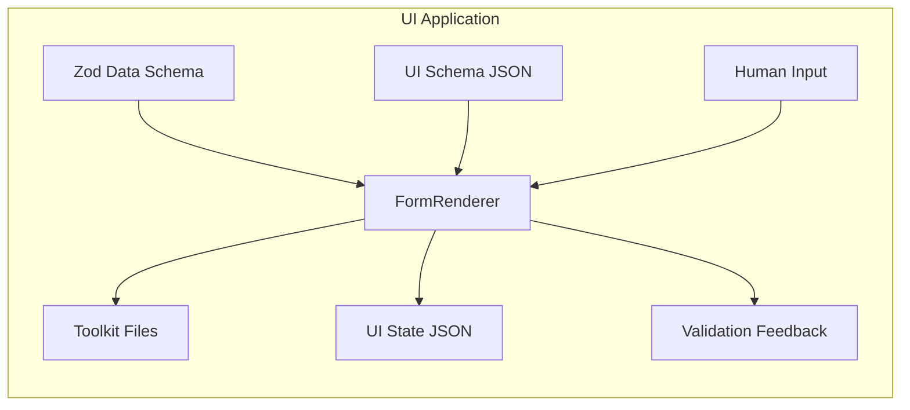

# Cognite Toolkit Wizard (Docs-as-Code UI)

Local-first UI that scaffolds a Cognite Data Fusion Toolkit project. The app orchestrates `cdf` CLI commands via a local file bridge and emits Toolkit config files (`cdf.toml`, `config.[env].yaml`) plus UI-state JSON under `project_templates/**`. No outbound network calls; file access is local-only.

## What is this

- Single-user, local UI for initializing and iterating on a Toolkit repo (single-phase wizard).
- Web-first delivery (static app) with a local file-bridge for safe exec/reads/writes within the selected repo root.
- Emits Toolkit files directly; legacy requirements templates are deprecated but kept for reference.

## Key principles

- Maintainability, scalability, and developer experience
- Local-only, offline by default; no auth or cloud access
- Schema-driven validation for emitted Toolkit config (`schema/config_env.schema.json`), deterministic YAML (stable ordering, LF newlines)
- Round-trip editing via UI-state JSON snapshots; resume by scanning existing Toolkit files

## Packages

- `packages/ui-app`: Vite + React app shell, wizard (Tier 00 only)
- `packages/form-renderer`: Maps UI schema to React Hook Form controls
- `packages/shared-types`: Shared TypeScript types and base Zod schemas
- `packages/yaml-emitter`: Deterministic YAML emit helpers
- `packages/ui-components`: Owned UI primitives and form controls
- `packages/file-bridge-client`: Local filesystem/exec bridge client (scoped writes + command exec)

## Quickstart

1. Connect your repository
    - Pick a local repo root and verify the file‑bridge status (header chip).
2. Check Toolkit availability
    - The app runs `cdf --version`. If missing, follow the uv instructions to install into `.venv`.
3. Initialize the repo
    - In the wizard, pick a repository host and run `cdf repo init --host <host>` (idempotent).
4. Define environments and modules
    - Add `dev`/`prod` (or others), variables (nested allowed), and module names.
5. Generate files
    - On Finish, the app runs pending commands (e.g., `modules add`) and writes `config.[env].yaml`.

## Visuals

### End-to-end workflow (where the UI fits)

```mermaid
flowchart TD
    A[Domain Knowledge<br/>Notes, Slides] --> B[UI App<br/>Schema-driven Form]
    Z[Zod Data Schema] --> B
    U[UI Schema JSON] --> B

    B --> Y1[Toolkit Files<br/>(cdf.toml, config.[env].yaml)]
    B --> Y2[UI-state JSON]

    Y1 --> G[Git Repo]
    Y2 --> G

    Y1 --> G
    G --> H[Toolkit Deploy CI]
    H --> I((CDF))

    K[Data Sources] --> L[Load to RAW]
    L --> I

    H --> M[Run Transformations]
    M --> N[Populate Views<br/>DM instances]
    N --> O[Verify via Queries<br/>GraphQL / Instances]

    subgraph T[Wizard]
        T1[Tier 00]
    end
    T1 --> B
```

- UI Tool (this repo): renders forms, executes `cdf` commands, and emits Toolkit files + UI-state JSON
- CI deploys to CDF using the Toolkit
- Data flow: data sources loaded to RAW, transformations run, instances verified

### App inputs and outputs (zoom-in)



- Inputs
    - UI Schema JSON and human input captured via React Hook Form
    - Minimal JSON Schema for config validation (`schema/config_env.schema.json`)
    - Basic controls: text, textarea, select, multiselect, array editor, directory picker
- Outputs
    - Toolkit Files: `cdf.toml`, `config.[env].yaml`
    - UI State JSON: `project_templates/ui-state/00_toolkit.json`
    - Validation Feedback: per-step via UI and schema validation
    - Deterministic Formatting: stable key order, LF newline, no trailing spaces
    - Round-trip Load: repo scan (reads `cdf.toml`, `config.*.yaml`, `modules/`)
- File I/O
    - Project Root Selector: choose repo root; scoped writes plus `exec` via local file-bridge

<!-- MVP scope intentionally omitted from README to avoid volatility. Key functional details are reflected above in Inputs/Outputs. -->

## Outputs and layout

- Toolkit files at repo root: `cdf.toml`, `config.[env].yaml`
- UI-state: `project_templates/ui-state/00_toolkit.json`

Example layout

```text
project_templates/
  ui-state/
    00_toolkit.json
config.dev.yaml
config.prod.yaml
cdf.toml
(.env management handled by Toolkit; UI does not write .env files)
modules/
  my_module/
    module.toml
    data_models/
      .gitkeep
    transformations/
      .gitkeep
    spaces/
      .gitkeep
    auth/
      .gitkeep
```

## Non-functional constraints

- Local-only, offline (no outbound network calls)
- All writes are scoped to the selected repo root under `project_templates/**`, `cdf.toml`, `config.*.yaml`, `.env.example`, and `.github/**`
- Deterministic YAML formatting; single trailing newline; no trailing spaces
- Performance targets: fast render (<300 ms typical), fast emit (<200 ms typical)

## Utility scripts

- `pnpm preview`: start a static preview server for the production build of `ui-app`
- `pnpm init-project /abs/path/to/repo`: initialize a minimal `project_templates/` tree at the provided repository root
    - Creates `project_templates/00_Solution_Design_Principles.yaml`, `project_templates/ui-state/`, and a sample `modules/example_module` structure
- `pnpm smoke`: run a smoke test verifying production bundles exist in `packages/ui-app/dist/`

## Current capabilities

- Schema-driven forms: all tiers (00/01/XX) rendered via a UI schema and Zod validation
    - Tier 00 includes environments, RAW sources, roles, toolkit, promotion, standards, inheritance, external models, observability, and id macros
    - Tier 01 and XX support repeatable objects/relationships and properties/relationships
- Round-trip editing: prefers `project_templates/**/ui-state/*.json`, falls back to YAML import
- Deterministic YAML: deep stable key ordering, LF newline, no trailing spaces
- Edge relationships: conditional validation enforces `edgeSpace` and `edgeTypeExternalId` when `type = edge`
- File bridge integration: health indicator in header; reads/writes are constrained to `project_templates/**`
- Developer UX: recent repository roots dropdown in header; clipboard copy for YAML outputs

## Getting started (dev)

- Prerequisites
    - Node 20 LTS and pnpm (via Corepack)
- Commands (from `app/` directory)
    - Install: `pnpm install`
    - Dev app: `pnpm dev`
    - Build all packages: `pnpm build`
    - Preview app: `pnpm preview`
    - Initialize `project_templates/` at a repo root: `pnpm init-project /abs/path/to/repo`
    - Smoke test (checks prod build artifacts): `pnpm smoke`
    - Start local file bridge for dev (scoped writes + exec): `pnpm dev-bridge`
    - Start both dev server and file bridge with consolidated logs: `pnpm dev-all`

## References

- Product and architecture plan: `requirements/requirements_doc.md`
- Template schemas (JSON + examples): `schema/`
