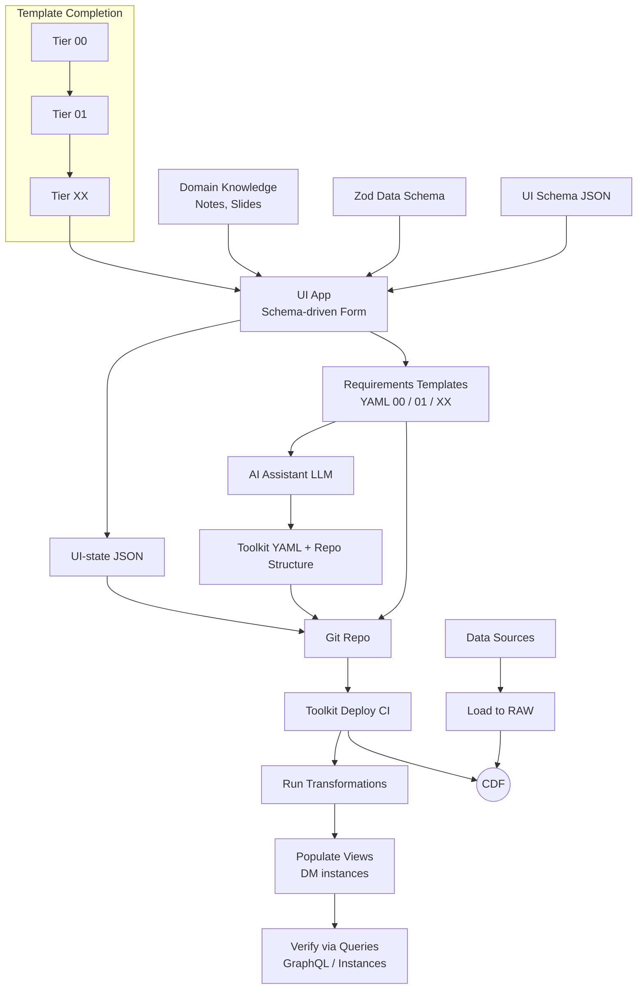
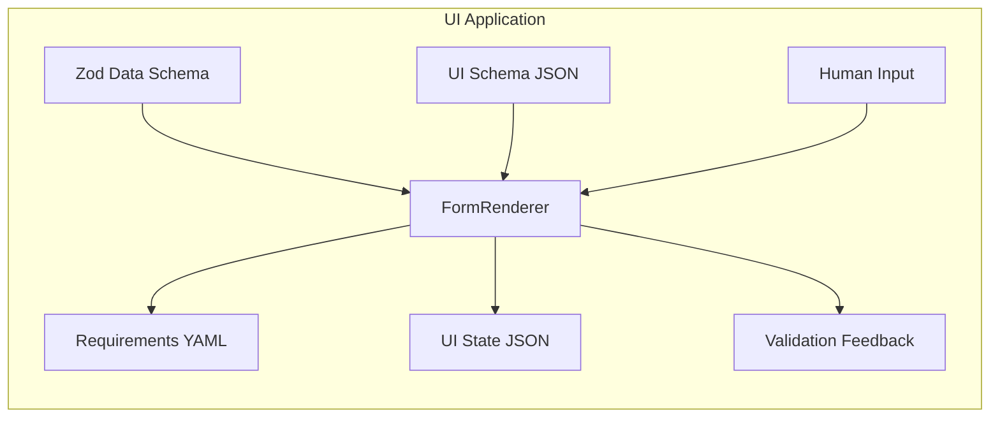

# Cognite Docs-as-Code UI (monorepo)

A local-first, schema-driven UI for authoring requirements templates for Cognite Data Fusion projects. The app renders Zod/JSON-schema–backed forms and emits deterministic YAML and UI-state JSON under `project_templates/**`. No outbound network calls; file access is local-only.

## What is this

- Single-user, local UI that helps Solution Architects and SMEs author three requirements templates:
    - Tier 00: `00_Solution_Design_Principles.yaml` (project-wide)
    - Tier 01: `01_Conceptual_Model.yaml` (per module)
    - Tier XX: `XX_Object_Specs/*.yaml` (per object)
- Web-first delivery (static app) with an optional local file-bridge for safe reads/writes within a selected repo root.
- Downstream conversion from requirements YAML to Toolkit YAML happens outside the UI (AI-assisted or scripted).

## Key principles

- Maintainability, scalability, and developer experience
- Local-only, offline by default; no auth or cloud access
- Schema-driven validation and deterministic YAML emit (stable ordering, LF newlines)
- Round-trip editing via UI-state JSON snapshots

## Packages

- `packages/ui-application`: Vite + React app shell, routing, tier features (00/01/XX)
- `packages/form-renderer`: Maps UI schema to React Hook Form controls
- `packages/shared-types`: Shared TypeScript types and base Zod schemas
- `packages/yaml-emitter`: Deterministic YAML emit helpers
- `packages/ui-components`: Owned UI primitives and form controls
- `packages/file-bridge-client`: Local filesystem bridge client (scoped to `project_templates/**`)

## Visuals

### End-to-end workflow (where the UI fits)



- UI Tool (this repo): renders forms and emits requirements YAML + UI-state JSON only
- Outside UI: AI assistant converts requirements into Toolkit YAML; CI deploys to CDF
- Data flow: data sources loaded to RAW, transformations run, instances verified

### App inputs and outputs (zoom-in)



- Inputs
    - Zod Data Schema: data shape and validation rules (TS types via `z.infer`)
    - UI Schema JSON: presentation metadata (labels, layout, component types)
    - Human Input: user-provided values captured via React Hook Form
    - Relationship Fields: capture `direct` and typed `edge` with required metadata (`edgeSpace`, `edgeTypeExternalId`), optional `label`, and `multiplicity`
    - Basic Controls: text, textarea, select
- Outputs
    - Requirements YAML: deterministic files under `project_templates/**`
    - UI State JSON: snapshots under `project_templates/**/ui-state/` for round-trip
    - Validation Feedback: per-field errors from Zod + RHF
    - Deterministic Formatting: stable key order, LF newline, no trailing spaces
    - Round-trip Load: prefers existing `project_templates/**/ui-state/*.json`; otherwise falls back to YAML when present
- File I/O
    - Project Root Selector: choose repo root; reads/writes constrained to `project_templates/**` (via local file-bridge for web delivery)

<!-- MVP scope intentionally omitted from README to avoid volatility. Key functional details are reflected above in Inputs/Outputs. -->

## Templates and outputs

- Tier 00 — Solution Design Principles
    - Output: `project_templates/00_Solution_Design_Principles.yaml`
    - UI-state: `project_templates/ui-state/00_solution_design.json`
- Tier 01 — Conceptual Model (per module)
    - Output: `project_templates/modules/<module>/01_Conceptual_Model.yaml`
    - UI-state: `project_templates/modules/<module>/ui-state/01_conceptual_model.json`
- Tier XX — Object Specification (per object)
    - Output: `project_templates/modules/<module>/XX_Object_Specs/<object>.yaml`
    - UI-state: `project_templates/modules/<module>/ui-state/xx/<object>.json`

Example layout

```text
project_templates/
    00_Solution_Design_Principles.yaml
    ui-state/
        00_solution_design.json
    modules/
        well_performance/
            01_Conceptual_Model.yaml
            XX_Object_Specs/
                well.yaml
                work_order.yaml
            ui-state/
                01_conceptual_model.json
                xx/
                    well.json
                    work_order.json
```

## Non-functional constraints (MVP)

- Local-only, offline (no outbound network calls)
- All file I/O is constrained to the selected repo root under `project_templates/**`
- Deterministic YAML formatting; single trailing newline; no trailing spaces
- Performance targets: fast render (<300 ms typical), fast emit (<200 ms typical)

## Utility scripts

- `pnpm preview`: start a static preview server for the production build of `ui-application`
- `pnpm init-project /abs/path/to/repo`: initialize a minimal `project_templates/` tree at the provided repository root
    - Creates `project_templates/00_Solution_Design_Principles.yaml`, `project_templates/ui-state/`, and a sample `modules/example_module` structure
- `pnpm smoke`: run a smoke test verifying production bundles exist in `packages/ui-application/dist/`

## Current capabilities

- Schema-driven forms: all tiers (00/01/XX) rendered via a UI schema and Zod validation
    - Tier 00 includes environments, RAW sources, roles, toolkit, promotion, standards, inheritance, external models, observability, and id macros
    - Tier 01 and XX support repeatable objects/relationships and properties/relationships
- Round-trip editing: prefers `project_templates/**/ui-state/*.json`, falls back to YAML import
- Deterministic YAML: deep stable key ordering, LF newline, no trailing spaces
- Edge relationships: conditional validation enforces `edgeSpace` and `edgeTypeExternalId` when `type = edge`
- File bridge integration: health indicator in header; reads/writes are constrained to `project_templates/**`
- Developer UX: recent repository roots dropdown in header; clipboard copy for YAML outputs

## Getting started (dev)

- Prerequisites
    - Node 20 LTS and pnpm (via Corepack)
- Commands (from `app/` directory)
    - Install: `pnpm install`
    - Dev app: `pnpm dev`
    - Build all packages: `pnpm build`
    - Preview app: `pnpm preview`
    - Initialize `project_templates/` at a repo root: `pnpm init-project /abs/path/to/repo`
    - Smoke test (checks prod build artifacts): `pnpm smoke`
    - Start local file bridge for dev (writes limited to `project_templates/**`): `pnpm dev-bridge`
    - Start both dev server and file bridge with consolidated logs: `pnpm dev-all`

## References

- Product and architecture plan: `requirements/requirements_doc.md`
- Template schemas (JSON + examples): `schema/`

