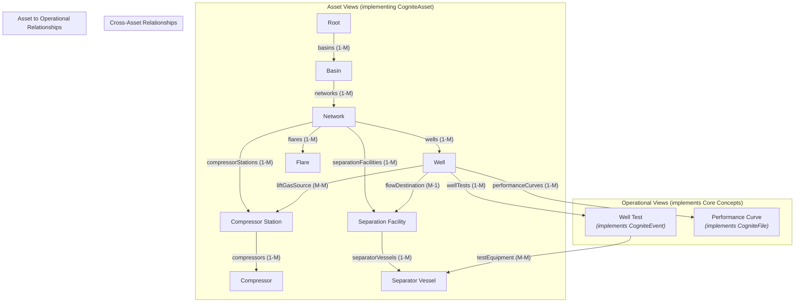

# OilProducingCompany Data Model Overview

This document describes the main conceptual objects in the OilProducingCompany (OPC) data model for an oil-field network and explains the parent–child relationships between them. The focus is on the business logic, independent of any Cognite Data Fusion (CDF) implementation details. From a subject-matter expert's perspective, this model correctly identifies the key assets involved in artificial lift operations. The following sections provide expanded details on their relationships and critical attributes for operational monitoring, optimization, and reliability.

## Object Hierarchy

1. Root
2. Basin
3. Network
4. Well
5. Compressor Station
6. Compressor
7. Separation Facility
8. Separator Vessel
9. Flare
10. Well Test
11. Performance Curve

---

### 1. Root

The **Root** represents the entire company (OilProducingCompany). It has no physical characteristics; it simply owns all other assets.

### Children

- **Basin** – one root can have many basins.

### Key Attributes

- Legal entity name and ID
- Corporate headquarters location (lat/long or address)
- Reporting currency and fiscal calendar
- Default time zone for data aggregation
- Start date of operations

### Time-Series Data

- The Root asset itself does not have any direct time-series measurements associated with it. Its primary role is organizational. All operational KPIs at this level are aggregations calculated from its descendant assets (e.g., total company production, total emissions), which are rolled up through the asset hierarchy.

---

### 2. Basin

A **Basin** is a geological area that contains hydrocarbons (e.g., *North Basin*, *South Basin*). For the data model it mainly serves as a locational grouping.

### Parents

- Root (one-to-many)

### Children

- **Network** – a basin can contain one or more networks.

### Key Attributes

- Basin name and local alias
- Geographic footprint (polygon or bounding box)
- Region / country
- Primary producing formations or horizons
- Start-of-production date
- Aggregate estimated ultimate recovery (EUR)

### Key Time-Series Data and Operational KPIs

- Similar to the Root, a Basin does not typically have direct, raw time-series sensor data. It serves as a geographical and geological grouping.
- **Aggregated KPIs**: Key metrics are calculated by aggregating data from the Networks contained within the basin. These include:
    - Total Oil/Gas/Water Production
    - Total Gas Injection & Flaring Volumes
    - Aggregate Water Cut & Gas-Oil Ratio (GOR)
    - Regional emissions totals

### Operational Notes

- Basins are used for regional break-downs of production, reserves, or economics.
- Basin boundaries are generally static; wells, networks, and facilities may be reassigned only under exceptional circumstances (e.g., corporate acquisitions).
- Regulatory and environmental constraints (e.g., flaring permits, emissions targets) are often managed at the basin level.

---

### 3. Network

A **Network** groups the assets that make up a particular oil-field operation, defining a closed-loop system for gas-lift.

Key points:

- **Parent**: Basin (one-to-many). A network is geographically and operationally contained within a single basin.
- **Constituent Assets** (many-to-one): A network is comprised of Wells, Compressor Stations, Separation Facilities, and Flares. These are not strictly children, but components of the network system.
- Compressors and Separator Vessels inherit the network relationship through their parent facilities.
- The network is frequently divided into **Injection** and **Production** halves, forming a complete cycle:
    - *Production side*: Routes produced fluids from wells to separation facilities. A portion of the separated gas is sent to the injection side.
    - *Injection side*: The gas is compressed at a compressor station and injected back into producer wells to provide artificial lift, boosting production.
- Networks are designed to be operationally isolated, although inter-network connections for gas sharing can exist.

### Key Attributes

- Network identifier / name
- Fluid system (oil, gas, or multiphase)
- Design capacity (MMscf/d or BOPD)
- Operating status (active, idle, decommissioned)
- Target injection discharge pressure (psi) from compressor stations
- Target production separator inlet pressure (psi)
- Surface network schematic reference ID (P&ID)

### Key Time-Series Data and Operational KPIs

A Network's performance is monitored through a combination of direct measurements and, more commonly, KPIs aggregated from its constituent assets.

- **Total Gas Injected (MMscf/d)**: An aggregated time series, calculated as the sum of flow rates from all active injection wells or from the discharge of compressor stations. Crucial for managing the overall gas lift system.
- **Total Oil/Gas/Water Produced (BBL/d, MMscf/d)**: Aggregated time series from all producing wells, representing the network's total output.
- **Total Gas Flared (MMscf/d)**: An aggregated time series from all flare assets within the network. A key environmental and economic KPI.
- **Network Injection/Discharge Pressure (psi)**: While often measured at specific points (like a compressor station discharge header), this can be represented as a key network-level time series. It reflects the overall pressure required to inject gas into the wells.
- **Gas-Lift Efficiency (bbl/MMscf)**: A critical *calculated* KPI, derived by dividing the total incremental oil produced by the total gas injected. It is the primary indicator of optimization success.

### Additional Relationships

- Networks often share trunk lines or regional compressor stations; capture these as *inter-network connections* if applicable.
- Fiscal allocation of produced fluids is typically performed at the network level before custody transfer.

---

### 4. Well

Wells are the physical conduits that access hydrocarbon reservoirs. Each well can function as a **producer** (flowing fluids to surface) or as an **injector** (receiving lift gas, water, or CO₂ to stimulate production). Artificial lift—most commonly **gas-lift** in this context—reduces bottom-hole flowing pressure to enhance production.

### Parents

- Network (many-to-one) – a well is part of a single network's operations.

### Key Asset Relationships

- **Flow Destination**: A producing well sends its multiphase fluid to a `Separation Facility`. This is a critical, time-dependent relationship.
- **Lift Gas Source**: A gas-lifted well receives injection gas from the network, which is pressurized by one or more `Compressor Stations`.
- **Children**: Well Tests (one-to-many), Performance Curves (one-to-many)

### Key Attributes

- API / UWI (unique well identifier)
- Surface coordinates (lat/long) and pad identifier
- Well type (producer, injector, water disposal, observation)
- Lift method (gas-lift, ESP, rod pump, plunger, natural-flow). For gas-lift, this implies the presence of:
    - *Gas-lift mandrels*: pockets in the tubing string to hold valves.
    - *Gas-lift valves*: devices that open/close to allow gas from the annulus into the tubing.
- Spud date / first-production date
- Current status (producing, shut-in, workover, P&A)
- Target formation(s) and completion intervals
- Tubing / casing sizes
- Maximum allowable operating pressure (MAOP)
- Ownership / working interest

### Key Time-Series Data and Operational KPIs

Wells are data-rich assets, providing the most granular insight into reservoir and production performance.

- **Flowing Tubing Pressure / Wellhead Pressure (psi)**: The pressure measured at the top of the well on the tubing string. This is a primary indicator of well stability and performance. A decline can signal production issues like liquid loading.
- **Flowing Casing Pressure (psi)**: The pressure in the annular space between the tubing and casing. In gas-lift wells, this reflects the pressure of the injection gas being supplied to the downhole valves.
- **Gas-Lift Injection Rate (MMscf/d)**: The measured flow rate of lift gas being injected into the well's annulus. This is a key controllable parameter for optimizing production.
- **Choke Valve Opening (%)**: The position of the surface choke valve that controls the well's output. This is a critical operational setpoint, often adjusted by optimization routines.
- **Downhole Pressure & Temperature (psi, °F/°C)**: For wells equipped with permanent downhole gauges (PDGs), these are invaluable time series for understanding reservoir behavior and inflow performance without needing a well test.
- **Production Rates (Oil, Gas, Water)**: While direct, continuous three-phase measurement at the wellhead is uncommon, these rates are often *allocated* back to the well from downstream facility measurements. These allocated rates, presented as time series, are the basis for all production accounting and analysis.

### Additional Relationships

- A well may flow to different separation facilities over its life cycle; track active facility assignments by effective date range.
- Wells may be grouped into patterns, pads, or facility flowlines for network modeling.

---

### 5. Compressor Station

A **Compressor Station** is a physical site that houses one or more compressors. Its primary function in a gas-lift network is to take low-pressure gas from the production side and boost it to the high pressure required for injection. It aggregates the performance of all contained compressors (e.g., total flow rate is the sum of individual compressor flow rates).

Relationship summary:

- **Parent**: Network (many-to-one) – a station serves a specific network.
- **Children**: Compressors (one-to-many)
- A station becomes non-operational only when *all* compressors are non-operational; if at least one compressor is active, the station is considered active.

### Key Attributes

- Station identifier / name
- Surface coordinates
- Number of compressor skids
- Aggregate horsepower
- Design suction and discharge pressures. These are critical design parameters that define the station's operating envelope.
- Installed gas-cooling capacity (aftercoolers are essential to manage gas temperature before re-injection).
- Power supply type (grid, gas-engine, dual-fuel)
- Environmental permit IDs

### Key Time-Series Data and Operational KPIs

A station's data is a mix of its own specific measurements and aggregations from the compressors it contains.

- **Station Suction Header Pressure & Temperature (psi, °F/°C)**: The pressure and temperature of the gas entering the station from the separation facilities. A low suction pressure can starve the compressors.
- **Station Discharge Header Pressure & Temperature (psi, °F/°C)**: The final pressure and temperature of the gas after compression and cooling, before it is sent to the network for injection. The discharge pressure is a key control parameter for the entire gas-lift network.
- **Total Station Throughput (MMscf/d)**: An aggregated time series representing the sum of the flow rates from all individual compressors currently running at the station.
- **Total Fuel Gas Consumption (MMscf/d)**: An aggregated time series of the fuel gas used by all gas-engine-driven compressors.
- **Station Availability (%)**: A calculated KPI time series, representing the percentage of time the station is capable of meeting the network's demands. It is a function of the availability of its individual compressors.

### Additional Relationships

- Stations often have dedicated slug catchers or inlet separators; model these as child equipment if detailed material balance is required.

---

### 6. Compressor

A **Compressor** is an engine that pressurizes natural gas, providing the positive head required for artificial lift in wells. It is a sub-component of a Compressor Station. Typical properties include make, model, manufacturer, horsepower, etc.

Relationship summary:

- **Parent**: Compressor Station (many-to-one)
- Multiple compressors can belong to a single station.
- Compressors can break down and become non-operational.

### Key Attributes

- Compressor tag / skid ID
- Make and model
- Type: Reciprocating, Centrifugal, Screw
- Serial number
- Driver type (electric motor, gas engine, turbine)
- Rated horsepower (HP)
- Maximum RPM
- Design suction / discharge pressures
- Max volumetric flow rate
- Efficiency curve reference (e.g., head vs. flow, power vs. flow)
- Installation date
- Last major overhaul date

### Key Time-Series Data and Operational KPIs

Individual compressors are heavily instrumented for performance monitoring and predictive maintenance.

- **Suction & Discharge Pressure/Temperature (psi, °F/°C)**: Measured at the inlet and outlet of an individual compressor skid. The pressure ratio across the compressor is a key performance indicator.
- **Flow Rate (MMscf/d)**: The measured volumetric flow rate of gas through the compressor.
- **Rotational Speed (RPM)**: The speed of the compressor's driver (engine or motor). A critical parameter for controlling throughput.
- **Power Consumption (kW) or Fuel Gas Rate (MMscf/d)**: Measures the energy being consumed by the driver. A key input for efficiency calculations.
- **Vibration (in/s or mm/s)**: Time series from proximity probes on bearings and casings. An increase in vibration is a leading indicator of mechanical issues, making this essential for predictive maintenance.
- **Bearing Temperatures (°F/°C)**: Monitors the health of the compressor's bearings. Like vibration, this is critical for predicting failures.
- **Rod Load (%)**: For reciprocating compressors, this calculated time series measures the forces on the piston rod, ensuring it stays within mechanical limits.
- **Run Hours**: A continuously accumulating counter that tracks the total operational time since the last maintenance event. Used to schedule preventative maintenance.

### Additional Relationships

- Compressors may have individual scrubbers or pulsation bottles; capture as sub-components if needed for reliability analysis.

---

### 7. Separation Facility

A **Separation Facility** sits on the production side of the network, receiving multiphase fluid from multiple wells. It functions similarly to a compressor station, but for phase separation.

Relationship summary:

- **Parent**: Network (many-to-one)
- **Children**: Separator Vessels (one-to-many)
- Wells normally produce to separation facilities unless a well test is isolating production to a specific separator vessel.
- The same parent–child logic used for compressor stations and compressors applies here, but with different equipment characteristics.

### Key Attributes

- Facility identifier / name
- Surface coordinates
- Number of separator vessels
- Design inlet pressure and temperature
- Liquid handling capacity (BOPD / BWPD)
- Gas handling capacity (MMscf/d)
- Heater-treater or dehydrator presence
- Flare or vapor-recovery connection

### Key Time-Series Data and Operational KPIs

A facility's KPIs are primarily aggregations from its separator vessels and measurements of shared systems.

- **Facility Inlet Pressure & Temperature (psi, °F/°C)**: The pressure and temperature of the commingled production stream arriving from multiple wells.
- **Total Liquids Produced (BOPD, BWPD)**: Aggregated flow rates from the oil and water outlets of all separator vessels. These are often measured by custody-transfer-quality meters.
- **Total Gas Produced (MMscf/d)**: Aggregated gas flow rates from all separator vessels. A portion of this gas is sent to the compressor station for the gas-lift system.
- **Chemical Injection Rates (gal/day)**: The flow rates of various chemicals (e.g., corrosion inhibitors, demulsifiers, anti-foam agents) injected into the production stream to ensure operational integrity and fluid quality.
- **Volume to Flare (MMscf/d)**: The flow rate of gas being sent to the flare from this facility, measured by a dedicated meter.

### Additional Relationships

- Separation facilities often feed pipelines or storage tanks; capture custody-transfer meters as child equipment where allocation and fiscal accounting are required.

---

### 8. Separator Vessel

A **Separator Vessel** separates produced fluids into gas and liquid phases (two-phase) or gas, oil, and water phases (three-phase). They are pressurized vessels (unlike tanks).

Relationship summary:

- **Parent**: Separation Facility (many-to-one)
- Can be used for well-testing operations by isolating the flow from a single well.

### Key Attributes

- Vessel tag / name
- Separator type (2-phase, 3-phase, test)
- Design pressure (psi) and temperature (°F/°C)
- Vessel diameter and length
- Rated liquid volume (bbl)
- Level, pressure, and temperature sensor IDs and their controller setpoints
- Relief valve set pressure
- Corrosion allowance / inspection interval

### Key Time-Series Data and Operational KPIs

Vessels are equipped with sensors to monitor the separation process in real-time.

- **Operating Pressure (psi)**: The pressure inside the vessel, which is a key parameter for achieving efficient phase separation.
- **Operating Temperature (°F/°C)**: The temperature inside the vessel.
- **Gas Outlet Flow Rate (MMscf/d)**: The flow rate of gas leaving the top of the separator.
- **Oil Outlet Flow Rate (BBL/d)**: For three-phase separators, the flow rate of oil leaving the vessel.
- **Water Outlet Flow Rate (BBL/d)**: The flow rate of produced water being discharged from the vessel.
- **Interface Level (ft or in)**: A critical measurement indicating the height of the oil-water interface inside the vessel. This is used to control the draining of water and oil to prevent carry-over (water in oil) or carry-under (oil in water).
- **Differential Pressure (psi)**: The pressure drop between the vessel inlet and outlet. An increase can indicate foaming or fouling issues inside the vessel.

### Additional Relationships

- Vessels designated as *test separators* temporarily receive flow from a single well during well-testing operations.

---

### 9. Flare

A **Flare** is a critical safety and environmental control device used to combust waste gases from oil and gas operations. Flaring is necessary for managing gas released during upsets, startups, shutdowns, and emergencies, as well as for disposing of gas that is not economically viable to recover. By converting potent greenhouse gases like methane into CO₂ and water, flares mitigate the environmental impact of venting raw hydrocarbons.

### Parents

- **Network** (many-to-one) – A flare is operationally part of a single network. It typically receives waste gas streams from multiple sources within the network, such as separation facilities and compressor station emergency relief systems.

### Key Attributes

- Flare identifier / stack tag
- Surface coordinates (lat/long)
- Type (e.g., high-pressure, low-pressure, acid-gas, air-assisted, steam-assisted)
- Stack height and tip diameter
- Design combustion capacity (MMscf/d)
- Presence and size of a knock-out drum for liquid removal prior to combustion
- Ignition system type (e.g., electronic probe, flame front generator) and status
- Pilot fuel gas source and design consumption rate
- Environmental permit number and regulatory limits

### Key Time-Series Data and Operational KPIs

The following time-series data points are essential for monitoring flare performance, ensuring safety, and meeting environmental regulations.

- **Flared Gas Flow Rate (MMscf/d)**: A direct measurement of the volume of gas being combusted. This is the primary time series for quantifying emissions and product loss.
- **Flare Scrubber/Knock-out Drum Pressure (psi)**: This is a critical indicator of network pressure. Measured upstream of the flare, a sharp increase in this pressure signals an upset condition (e.g., compressor trip) is forcing gas to the flare. Operational procedures are tied to this measurement; for instance, if pressure exceeds set thresholds, gas-lift injection to wells is curtailed to prevent overwhelming the flare system and ensure network stability.
- **Flare Tip Temperature (°F/°C)**: A crucial time series from a thermocouple at the flare tip. It provides direct confirmation of flame presence. A sudden temperature drop can signal a "flame-out" event where unburnt hydrocarbons are vented.
- **Pilot Gas Flow Rate (MMscf/d)**: The continuous flow of fuel gas to the pilot burners. Monitoring this time series ensures the flare remains lit and ready to safely ignite any relief event.
- **Combustion Efficiency (%)**: A calculated time series, not directly measured. It is derived from other inputs like gas composition, assist gas flow, and flare tip temperature. This KPI is vital for environmental reporting, as it quantifies the destruction efficiency of hydrocarbons (typically >98%).
- **Smoke Opacity (%)**: An optical measurement of visible smoke, indicating incomplete combustion (soot). This is a continuous time series monitored to ensure compliance with air quality permits.
- **Assist Gas Flow Rate (scf/m)**: For steam- or air-assisted flares, this time series measures the flow of the assisting medium used to improve combustion efficiency and reduce smoke.

### Additional Relationships

- Flares are often physically located at, and receive gas from, a `Separation Facility` or `Compressor Station`. While its parent in the hierarchy is the `Network`, explicit relationships can be drawn to the specific facilities it serves.

---

### 10. Well Test

A **Well Test** is a planned data-gathering event that measures the production rates (oil, gas, water) from a single well under specific, stable operating conditions (e.g., fixed choke size, constant gas-lift injection rate). This provides a snapshot of the well's current potential. The well test is only effective until a newer well test is conducted; the new test then becomes the active basis for production allocation.

### Key Asset Relationships

- **Parent**: Well (one-to-many)
- **Test Equipment**: A well test is conducted using one or more `Separator Vessels`.

### Key Attributes

- Test identifier
- Well identifier
- Start and end timestamps
- Test duration (hours)
- Separator vessel(s) used
- Measured oil, gas, and water rates
- Gas-oil ratio (GOR) and water cut (WCUT)
- Flowing Tubing Pressure (FTP) and Flowing Casing Pressure (FCP)
- Choke size / bean size
- Test method (separator, multiphase meter, downhole gauge)

### Time-Series Data

A Well Test is not a source of continuous time-series data. Instead, it is a planned **event** during which high-frequency measurements are taken for a short, fixed duration (e.g., 6-24 hours). The output is a set of discrete, high-quality data points (e.g., average oil rate, final GOR, stable flowing pressure) representing the well's potential at that specific point in time. These discrete results are then used to calibrate the continuous, allocated production time series for the well.

### Operational Notes

- Only the most recent valid test is considered *active* for production allocation calculations.
- Historical tests remain valuable for decline analysis and for calibrating reservoir and wellbore models.

---

### 11. Performance Curve

A **Performance Curve** is a mathematical model that describes a well's expected behavior under varying conditions. For gas-lift wells, this typically represents the relationship between the amount of gas injected and the resulting oil production rate (a "lift curve"). These curves are derived from physics-based models, well tests, or a combination. The newest curve supersedes prior curves.

### Key Asset Relationships

- **Parent**: Well (one-to-many)

### Key Attributes

- Curve identifier
- Well identifier
- Valid-from and valid-to dates
- Curve type (e.g., gas-injection vs. oil-rate, Inflow Performance Relationship (IPR), Vertical Lift Performance (VLP))
- Assumed conditions for the curve (e.g., Water Cut, GOR, wellhead pressure)
- Data points (stored as tabular pairs or polynomial coefficients)
- Creation method (field test, nodal analysis, simulation)
- Author / engineer and creation date
- Comments / assumptions

### Time-Series Data

A Performance Curve is a static data object, typically representing a mathematical model (e.g., a set of polynomial coefficients or a table of x,y points). It does not generate or have time-series data associated with it. Instead, it is a model that is *used by* optimization systems, which may in turn generate time-series setpoints (like a recommended gas injection rate) for a well.

### Operational Notes

- The newest curve supersedes prior curves but historical versions should be retained for auditability.
- Performance curves are the core of gas-lift optimization. Allocation software uses these curves to determine how to distribute a limited supply of lift gas across many wells to maximize total oil production from the network.

---

## Cognite Data Model Implementation

This section outlines how the conceptual objects described above are mapped to a Cognite Data Model (CDM), following best practices for a graph-based, scalable, and AI-ready solution.

### General Design Principles

- **Dedicated Space**: The entire data model, including all its views, containers, and data instances, will be located in a dedicated **space**, `opc_assets`. This ensures modularity and clear access control.
- **Leveraging the Cognite Core Data Model**: For all objects that represent physical assets or equipment (e.g., `Well`, `CompressorStation`, `Basin`), we will create views that implement the `CogniteAsset` concept from the `CogniteCore` data model. This provides standardization and allows for native linking to other CDF resource types like `CogniteTimeSeries` and `CogniteFile`.
- **Handling Time-Series Data**: Operational KPIs (e.g., pressures, flow rates) will be modeled as individual `CogniteTimeSeries` and linked to their corresponding asset nodes via the built-in `timeSeries` relationship.
- **Modeling Relationships**: All parent-child hierarchies and operational connections will be modeled as **direct relationships** between views, creating a true graph structure for powerful, multi-hop queries.

### Proposed Data Model Views and Relationships

### View Implementation Details

- **`Root`, `Basin`, `Network`, `Well`, `Flare`, `CompressorStation`, `Compressor`, `SeparationFacility`, `SeparatorVessel`**:
    - **Type**: These will be modeled as Views that implement `CogniteAsset`.
    - **Reasoning**: This is the standard for physical or logical assets. It provides essential properties and enables seamless integration with time series, files, and events, creating a rich, contextualized graph. All specific attributes from the conceptual model (e.g., `Well.apiUwi`, `Compressor.make`) will be added as properties to their respective views.

- **`WellTest`**:
    - **Type**: A View that implements `CogniteEvent` from the core data model.
    - **Reasoning**: A `WellTest` is a planned, time-bound data-gathering **event**. Using `CogniteEvent` is the standard way to model such activities. It provides essential fields like `startTime`, `endTime`, and `type` out of the box. The specific well test results (e.g., `oilRate`, `gasRate`) will be stored in a dedicated `WellTest` container and mapped into this view.
    - **Relationships**: It will have a direct relationship to the `Well` it was performed on and the `SeparatorVessel`(s) used for the test.

- **`PerformanceCurve`**:
    - **Type**: A View that implements `CogniteFile` from the core data model.
    - **Reasoning**: A `PerformanceCurve` represents a set of data points or a mathematical model, which can be thought of as a document. Modeling it as a `CogniteFile` allows us to store the actual curve data (e.g., as a CSV or JSON) in the Cognite Files service, which is ideal for structured data. The view itself will hold the metadata (`curveType`, `validFromDate`, etc.) and provide a direct link to the file content.
    - **Relationships**: It will have a direct relationship to the `Well` it describes.

### Summary of Benefits

This data model design provides:

- **Graph-Native Structure**: Enables complex, multi-hop queries across the entire operational landscape.
- **Standardization**: Leverages the `CogniteCore` model for compatibility and integration with the full CDF feature set.
- **Clarity and Extensibility**: Offers a logical and direct translation of the domain knowledge, which is easy to maintain and extend.
- **AI-Optimized**: Creates a well-structured, contextualized graph, which is the ideal foundation for advanced analytics and AI applications, allowing them to easily traverse relationships and ground answers in authoritative data.
